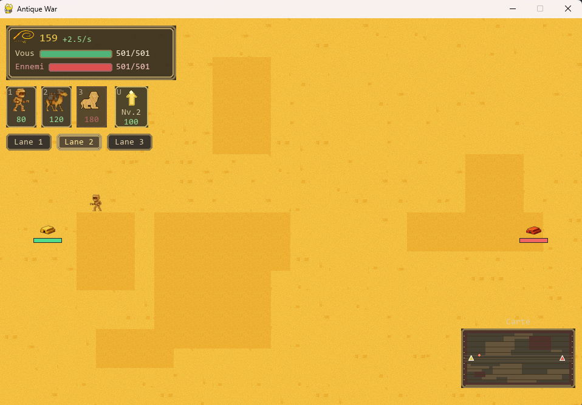
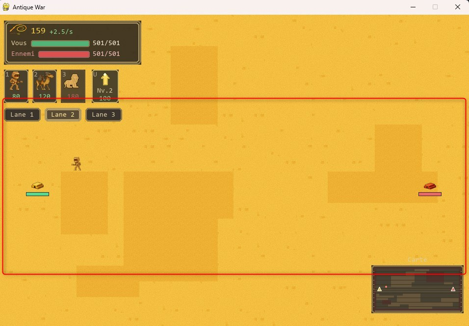
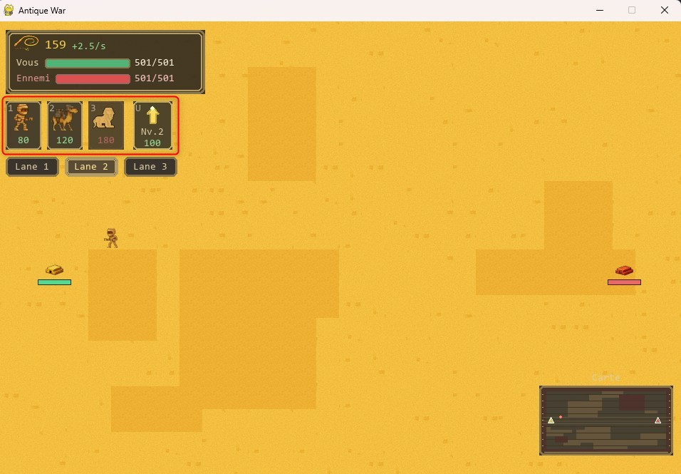
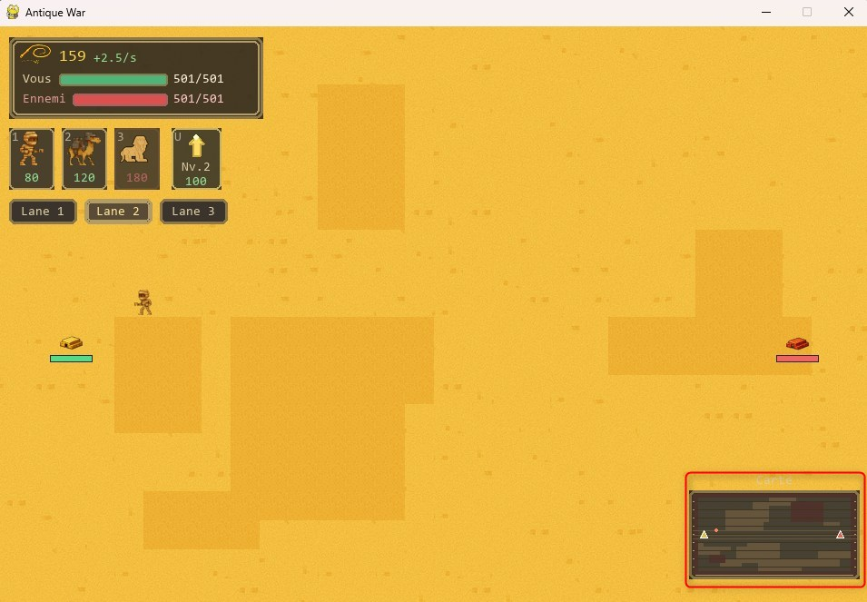

# Interface du jeu

L’interface d’Antique War permet au joueur d’accéder rapidement aux informations essentielles et d’interagir avec le jeu pendant une partie.

Elle est organisée autour de plusieurs zones distinctes à l’écran.

## Vue d’ensemble

L’écran de jeu est composé de plusieurs éléments :

- une zone de jeu centrale représentant le désert ;
- une zone d’informations située en haut à gauche ;
- une barre d’actions permettant d’invoquer des unités et d’améliorer la pyramide ;
- une mini-carte située en bas à droite.

## Zone de jeu centrale

La zone centrale affiche l’environnement de jeu.

Elle contient :

- le terrain désertique ;
- les pyramides du joueur et de l’ennemi ;
- les unités alliées et ennemies ;
- les obstacles présents sur le terrain.

Les unités se déplacent automatiquement dans cette zone en fonction de leur comportement et du terrain.

## Zone d’informations

La zone d’informations est située en haut à gauche de l’écran.

Elle affiche :

- la quantité actuelle de monnaie (𓍯) ;
- la vitesse de production de la monnaie par seconde ;
- les points de vie de la pyramide du joueur ;
- les points de vie de la pyramide ennemie.

Les points de vie sont représentés par des barres colorées associées à chaque pyramide.

## Barre d’actions

La barre d’actions permet au joueur d’effectuer les actions principales.

Elle contient :

- les boutons d’invocation des unités disponibles (Momie, Dromadaire blindé, Sphinx) ;
- le coût de chaque unité affiché sous son icône ;
- un bouton permettant d’améliorer la pyramide, avec indication du niveau actuel et du coût.

Les boutons deviennent utilisables lorsque le joueur dispose de suffisamment de monnaie.

## Sélection des voies

Sous la barre d’actions, le joueur peut sélectionner une voie de déplacement.

Trois voies sont disponibles :

- Lane 1
- Lane 2
- Lane 3

La voie sélectionnée détermine le chemin emprunté par les unités invoquées.

## Mini-carte

Une mini-carte est affichée en bas à droite de l’écran.

Elle représente :

- la position des pyramides ;
- la disposition générale du terrain ;
- les principales zones de déplacement.

Elle permet d’avoir une vision globale de la zone de jeu.

