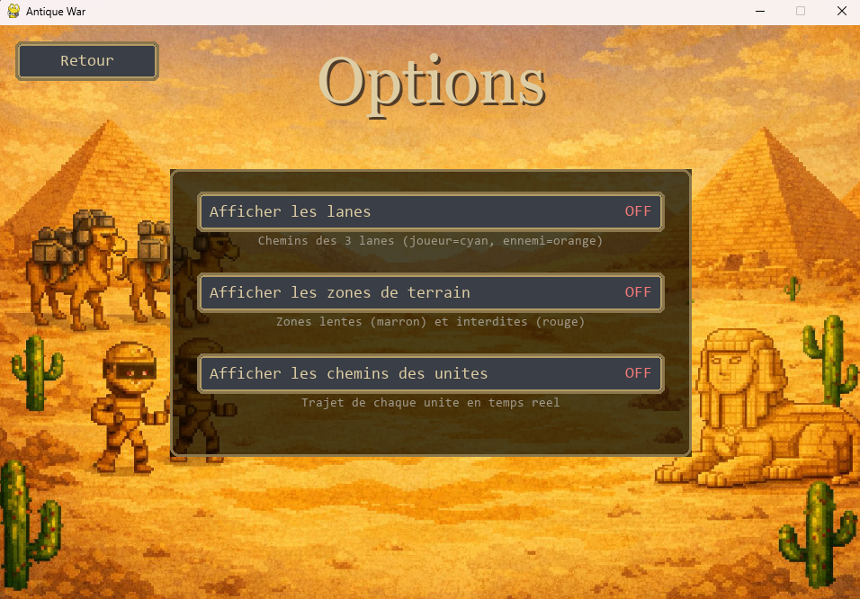
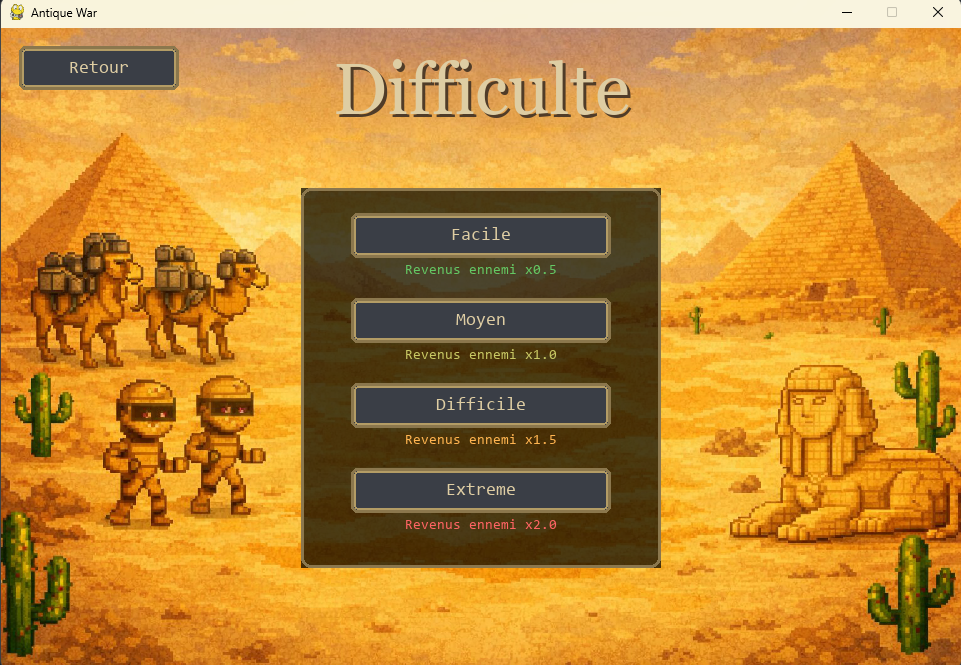
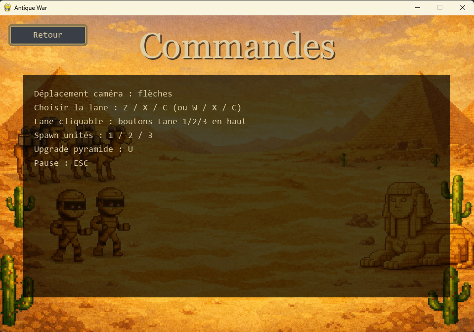

# Menus du jeu

Antique War dispose de plusieurs menus permettant au joueur de configurer le jeu et d’accéder aux différentes fonctionnalités.

Ces menus sont accessibles avant le lancement d’une partie.

---

## Menu principal

Le menu principal est affiché au lancement du jeu.

Il permet d’accéder aux différentes sections suivantes :

- Jouer : lance une nouvelle partie
- Options : ouvre le menu des options
- Commandes : affiche les contrôles du jeu
- Quitter : ferme le jeu

---

## Menu Options

Le menu Options permet d’activer ou de désactiver certaines aides visuelles pendant la partie.

Les options disponibles sont :

### Afficher les lanes
Affiche les chemins correspondant aux trois lanes du jeu.  
Les lanes du joueur sont affichées en cyan et celles de l’ennemi en orange.

### Afficher les zones de terrain
Affiche les différentes zones du terrain, notamment les zones ralenties et interdites.

### Afficher les chemins des unités
Affiche le trajet emprunté par chaque unité en temps réel.

---

## Menu Difficulté

Le menu Difficulté permet de choisir le niveau de difficulté de la partie.

Les niveaux disponibles sont :

- Facile : revenus ennemis ×0,5
- Moyen : revenus ennemis ×1,0
- Difficile : revenus ennemis ×1,5
- Extrême : revenus ennemis ×2,0

Le niveau de difficulté influence la production de ressources de l’ennemi.

---

## Menu Commandes

Le menu Commandes affiche les contrôles du jeu.

Les principales commandes sont :

- Déplacement de la caméra : flèches directionnelles
- Sélection de la lane : Z / X / C ou W / X / C
- Sélection de la lane via l’interface : boutons Lane 1, 2 et 3
- Invocation des unités : touches 1, 2 et 3
- Amélioration de la pyramide : touche U
- Pause : touche Échap
