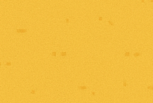

# Terrains et obstacles

Le champ de bataille est composé de différents types de terrains et d’obstacles.

Ces éléments influencent le déplacement des unités et leur vitesse.

## Types de terrain

### Désert

Le désert est le terrain standard du jeu.

Il ne modifie pas les caractéristiques des unités.  
Les unités peuvent y atteindre leur vitesse maximale.

Caractéristiques :

| Effet | Valeur |
|-----|-------|
| Vitesse des unités | Maximale |

### Sables mouvants

Les sables mouvants ralentissent les unités qui les traversent.

Caractéristiques :

| Effet | Valeur |
|-----|-------|
| Vitesse des unités | Vitesse maximale / 2 |
