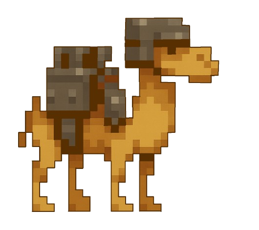
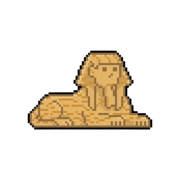

# Unités

Les unités permettent au joueur d’attaquer la pyramide ennemie et de défendre la sienne.

Chaque unité possède un coût, une vitesse, une puissance d’attaque et des points de vie différents.

---

## Momie

La Momie est l’unité de base du jeu.

Elle est rapide mais possède peu de points de vie et inflige peu de dégâts.  
Elle est principalement utilisée comme première unité disponible.

Caractéristiques :

| Attribut | Valeur |
|--------|--------|
| Coût | 10 𓍯 |
| Vitesse | 10 |
| Dégâts | 8 |
| Points de vie | 15 |

---

## Dromadaire blindé

Le Dromadaire blindé est une unité intermédiaire.

Il offre un équilibre entre vitesse, résistance et puissance d’attaque.

Caractéristiques :

| Attribut | Valeur |
|--------|--------|
| Coût | 25 𓍯 |
| Vitesse | 6 |
| Dégâts | 20 |
| Points de vie | 50 |

---

## Sphinx

Le Sphinx est l’unité la plus puissante du jeu.

Il est lent mais possède une grande résistance et inflige des dégâts importants.

Caractéristiques :

| Attribut | Valeur |
|--------|--------|
| Coût | 75 𓍯 |
| Vitesse | 4 |
| Dégâts | 40 |
| Points de vie | 120 |

---

Pour plus d’informations sur l’environnement de jeu, consultez  
[Terrains et obstacles](terrains.md).
